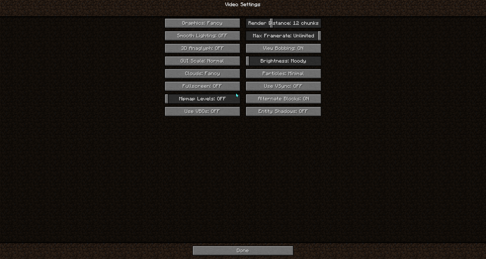

# Profiler Fix
A small performance boosting mod. Removes the minecraft profiler which is not needed for the normal user.

With profiler fix:
Without profiler fix:
Minecraft settings:
Server: eu.loyisa.cn,
PC Specs: i7 6700, gtx 1650, 32 gigs of ram,
Launch args for test: -Xmx6G -XX:+UnlockExperimentalVMOptions -XX:+UseG1GC -XX:G1NewSizePercent=20 -XX:G1ReservePercent=20 -XX:MaxGCPauseMillis=50 -XX:G1HeapRegionSize=32M
